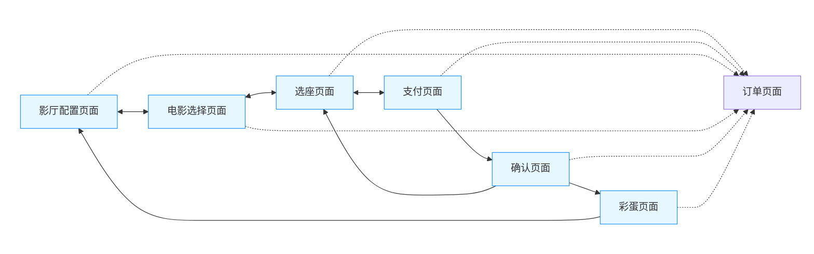

# 三四五：电影院选座

清华大学软件学院2025夏《Web前端技术实训》课程

三四五组大作业：电影院选座


## 一、项目介绍

### 1.1 预览

（TODO：此处放一个视频）

### 1.2 项目背景

* 项目目标：使用 Canvas 技术设计并实现一个可交互的电影院选座软件
* 核心需求：支持个人与团体票的自动和手动选座，并根据不同年龄段（少年、成年、老年）的观众遵循特定的选座规则

### 1.3 实现功能预览

* 基础功能
  * 影厅绘制：基于 Canvas 绘制弧形排列的电影院座位图，包含明确的排号和座位号
  * 座位状态：不同颜色直观展示座位状态
  * 选座模式：支持单选、多选，以及根据规则的智能自动选座
  * 票务管理：实现了预订、付款购票、取消预定、退票退款等一系列票务操作流程

*  扩展功能
  * 不同大小的放映厅：通过静态配置参数实现96人、200人、300人的放映厅
  * 动态配置：支持通过页面上的交互组件自定义不同大小的影厅
* 其他优点
  * 动态效果
  * 视觉美感
  * 内涵彩蛋，敬请期待~

## 二、使用说明

### **2.1 运行环境**

* 推荐浏览器：Google Chrome 浏览器的最新稳定版
* 打开方式：直接在浏览器中打开 `index.html` 即可

### **2.2 界面布局介绍及操作指南**

本次作业网站主要由五个界面组成，分别是影厅配置界面、电影选择界面、选座界面、支付界面、确认界面。
- 进入网页自动打开**影厅配置界面**，该页面可以选择影厅规模（小厅、中厅、大厅以及自定义）。其中自定义如下图所示，可以通过输入排数以及每排座位数设置影厅大小。

	![[pic/size1.png]]
	![[pic/size2.png]]
- 选择完影厅规模后点击下方按钮 **下一步：选择电影** 跳转至电影选择界面，该界面布局十分简洁，共有三步电影可供选择，分别是罗小黑战记、蓦然回首以及情书，在电影名下方有对应的放映时间以及电影票价，信息完备。
	![[pic/choose_movie.png]]
	此外，我们实现了**根据不同电影更换页面背景**的功能，分别为三部电影设置了对应的背景，进一步美化了页面。
	![[pic/choose_movie1.png]]
	![[pic/choose_movie2.png]]
	![[pic/choose_movie3.png]]
- 选择完电影后点击下方按钮 **下一步：选择座位** 跳转至选座界面，选座界面分为上中下三部分。
	页面上部的左侧主要负责**客户信息输入**，同时提供**个人票与团体票**两种购买方式，两种购买方式均可购买单张或多张票，仅在购票逻辑上有所不同。用户可以通过单击单选座位，也可以通过`Ctrl+单击`多选座位，相同座位重复点击则视为取消选座。
	同时在右侧我们提供了**选座说明**，用于提醒客户选座规则，在下方我们设置了**自动选座按钮**，自动为客户提供可选座位中的最优座位。
	![[pic/input_information.png]]
	在页面的中部我们用**canvas技术**实现了影厅选座视图的绘制，用不同颜色表示座位的不同状态，并在下方予以说明。除此之外，我们添加了**根据不同电影主题更换座位图片**的功能，如下图所示，选择《罗小黑战记》时座位自动变为猫猫头的样子ouo
	在此，我们用中厅以及大厅的页面布局作为演示。
	![[pic/choose_seat.png]]
	![[pic/choose_seat1.png]]
	此外，我们提供了**切换布局**的按钮，用于在扇形视图与平行视图之间进行切换。
	![[pic/choose_seat_parallel.png]]
	在页面的下部，我们**提供了已选座位的信息**，用于帮助用户核对已选座位的状态，此时如若用户选择了座位，则会有座位信息相关的显示，点击信息右侧的 **'x'** 即可取消该座位的选座。同时我们**提供了影厅状态**，帮助客户清晰了解目前影厅的上座率等相关信息。
	同时，我们提供了**预订座位**以及**直接购票**的按钮，点击预订座位会跳过支付与确认页面，直接跳转至结算页面，而点击直接购票则会跳转至支付页面进行进一步确认。
	![[pic/other_information.png]]
	![[pic/other_information1.png]]
- 点击**直接购票**后跳转至**支付页面**，该页面主要供客户核对个人信息及选座信息是否无误，同时进行支付方式的选择，此处我们设置了四种支付方式，可以通过单击进行选择（**双击有彩蛋ouo**），同时可以尝试把鼠标悬停在问号图标上，有惊喜文字（x）
	![[pic/payment.png]]
- 在支付页面点击**确认支付**后跳转至**最终确认页面**，该页面负责对用户信息、座位信息以及支付相关信息做最后核对，确保支付流程的完整性与安全性。
	![[pic/confirm.png]]
	![[pic/confirm1.png]]
- 若客户确保以上信息都准确无误则可以点击**确认支付按钮**，跳转至**结算彩蛋页面**。、
- 除此之外，我们设计了**订单界面**，用于查看用户截至目前为止所有类型的订单，包括**已支付、预约中、已过期、已取消**等，在该界面点击查看订单详情可以查看详细信息。
	![[pic/order0.png]]
	详情界面如下，点开已支付的订单可以看到全部相关信息，在最下方有**申请退款**按钮，用户可以通过订单界面管理全部订单，操作简便。
	![[pic/order1.png]]
## 三、实现思路及技术应用

### 3.1 系统流程设计

（停云TODO：）

### 3.2 数据结构设计

（停云TODO：seat、ticket）

### 3.3 核心算法设计

（停云TODO：自动选座、选座验证、订单操作）

### 3.4 数据存储机制

影院涉及关键数据分为以下几个部分，根据调用需求不同以不同方式存储：

- **当前选择电影信息**：每一个电影和一个影厅大小可以确定一个特定影厅
  - **存储方式**：以对应的Key存在`localStorage`中。
  - **Key**：`selectedMovieInfo`
  - **存储内容**：行列信息`cols`、`rows`，电影信息`id`、`title`，电影贴图路径`image`，票价`price`，开始时间`time`

- **影院座位状态数据**：根据每一个电影和一个影厅大小可以确定的特定影厅，储存其座位状态。
  - **存储方式**：以对应的Key存在`localStorage`中。
  - **Key**：`cinemaState-{电影名}-{rows}x{cols}`。
  - **存储内容**：二维数组`cinemaSeats`，每个元素包含对应作为的`row`，` col`， `id`，`status`信息。
- 选座界面输入数据：选座界面接受的输入有客户输入的信息以及客户选择的具体座位。
  - **存储方式**：客户信息直接存储在 DOM 元素中，而选中座位则直接更改`main.js`中的座位状态并实时查询。
  - **存储内容**：票务类型，用户姓名及年龄。
- **订单信息**：订单信息包含座位信息、客户信息以及电影信息。
  - **存储方式**：以对应的Key存在`localStorage`中。
  - **Key**：`movieTicketOrders`
  - **存储内容**：为一个订单列表，每个订单包含信息有：购票Id`ticketId`，订单状态`status`，座位`seats`，客户信息`customerInfo`，电影信息`movieInfo`，单价`unitPrice`，总价`totalCost`，创建时间`createdAt`，过期时间`expiresAt`（预订票），支付时间`paidAt`（直购票或支付后的预定票）。


#### 当前选择电影信息

需要由前两个页面决定，因此先在第一个页面暂存行列信息后，进入第二个页面后得到所选电影，由此得到电影id、电影名、开始时间等信息，在初始化影院选座界面的实际存入`localStorage`，后续过程中对该信息只读不写，直到整个订单流程结束后，在返回配置界面时清除电影信息在`localStorage`中的存储，等待新订单重复前面的流程。

#### 影院座位状态数据

整个订单流程中，影院座位状态数据经历了三个阶段。

- **初始化阶段**：由前面两个界面选择结束后，可确定影院座位状态数据的Key，根据Key在`localStorage`中查找是否有了对应的座位状态信息，如果已经有就加载进当前的`cinemaSeats`，若没有，则初始化对应大小的影厅并存入`localStorage`等待后续调用。
- **选座阶段**：这一阶段仅会涉及到`available`和`selected`之间的切换，在订单确认之前无需存入`localStorage`，只需完成交互即可。
- **订单阶段**：订单完成后需要根据订单具体情况更改`cinemaSeats`的相应座位状态并存入`localStorage`，预定完成和支付完成两个动作只需要更改当前的信息即可，但是涉及到检查预定是否过期、退款、取消预定、支付预定、退款这几个操作则可能去更改当前`cinemaSeats`所存储座位状态以外的数据。因此需要根据订单存储的电影信息来查找对应Key并该Key下存储的影院座位状态数据。

#### 选座界面输入数据

客户信息只需要调用`getGroupMembersList()`和`getIndividualMembersList()`查询DOM来获取即可，而座位信息在处理订单相关的函数中只需要遍历`cinemaSeats`查看座位是否为`selected`状态即可。

#### 订单信息

在每一个与订单相关的操作完成后都同步到`localStorage`中，在系统启动时自动从`localStorage`中加载订单。

### 3.5 Canvas绘制

`canvas.js` 文件负责将影院座位数据以可视化方式呈现在页面上，核心机制如下：

#### 数据来源

- **座位数据**：从`main.js`获取，得到二维数组，每个元素为座位对象（包含 row、col、id、status 等）。
- **当前影厅配置**：从`main.js`获取，包括总排数、总列数等。
- **选中状态**：从`stateManager.js`获取获取当前被选中的座位列表，辅助高亮显示。

#### 绘制流程

`canvas.js`维护一个 GLOBAL_STATE 对象，记录当前画布、布局类型、行列数、中心区域信息等，确保绘制时状态一致。

- **初始化与绘制**：首先完成 Canvas 初始化、座位数据加载、图片预加载，并调用 drawCinema() 完成实际绘制。

- **核心绘制函数**：

  `drawCinema()`负责整体绘制流程，包括：

  - 清空画布
  - 绘制中央过道虚线
  - 计算并绘制中心区域
  - 遍历所有座位，调用 `drawSeat(x, y, seat)`绘制每个座位
  - 绘制中心区域标识（矩形或扇形，取决于布局）

- **座位绘制**
  `drawSeat(x, y, seat)`根据座位状态（available、selected、sold、reserved）选择不同图片或颜色，并在座位中心绘制排号和座号。若座位被选中或悬停，会有缩放高亮效果。
  
- **布局支持**
  支持弧形（ARC）和矩形（PARALLEL）两种布局，通过 `GLOBAL_STATE.currentLayout` 切换，分别采用不同的坐标计算方式。

#### 交互与刷新

- **布局切换**
  通过 `toggleLayout()` 切换布局类型，并自动重绘。
- **数据变更刷新**
  调用 `refreshCinemaDisplay()` 可在座位数据变化后重新绘制，确保画面与数据同步。

- 页面加载时自动初始化并绘制影院布局。
- 提供全局导出接口 `window.CanvasRenderer`，供其他模块调用绘制、刷新、布局切换等功能。

### 3.6 页面逻辑

页面逻辑主要关注各个页面之间的跳转，不同页面之前的跳转逻辑基本是顺序执行，订单页面独立于主要页面之外，可以从任意界面点进后返回该界面，该部分处理模仿目前主流电影选座网站，方便用户即时查看所有订单信息。


除了上述这些点击界面上的按钮的跳转功能，用户还可以点击页首的状态栏**直接进行跳转**，如下图所示，每个页面均可以跳转至之前的全部页面，而无法跳转至后序页面，保证了购票流程的正确性。

![[pic/yemei.png]]
### 3.7 交互设计

#### 交互系统架构

本项目的交互系统采用"状态中心化"设计，以`stateManager.js`为核心构建了完整的交互控制体系：

```
┌─────────────┐    ┌─────────────┐    ┌─────────────┐
│   Canvas    │ ←→ │ StateManager│ ←→ │ CinemaData  │
└─────────────┘    └─────────────┘    └─────────────┘
      ↑                   ↑                   ↑
      │                   │                   │
      ↓                   ↓                   ↓
┌─────────────┐    ┌─────────────┐    ┌─────────────┐
│   Renderer  │    │ User Input  │    │ Data Storage│
└─────────────┘    └─────────────┘    └─────────────┘
```

`stateManager.js`采用单一全局状态对象管理所有交互状态：

```
let globalState = {
    canvasElement: null,      // Canvas DOM元素
    canvasRect: null,         // Canvas位置信息
    hoveredSeat: null,        // 当前悬停座位
    isCtrlPressed: false,     // 键盘控制状态
    isInitialized: false      // 初始化标志
};
```

#### 鼠标交互流程

- **鼠标移动检测**：通过`handleCanvasMouseMove`实时计算鼠标位置
- **命中检测**：`performSeatHitDetection`计算鼠标与座位的几何关系
- **状态更新**：更新`hoveredSeat`并触发重绘
- **视觉反馈**：CanvasRenderer根据悬停状态调整座位渲染效果

#### 点击选择流程

- **点击事件处理**：`handleCanvasClick`捕获点击事件
- **模式判断**：根据`isCtrlPressed`判断单选/多选模式
- **座位状态切换**：调用`selectSeat`/`deselectSeat`修改状态
- **全局通知**：通过`notifySelectionChange`更新UI和订单信息

#### 键盘控制机制

- **多选模式**：通过Ctrl/Command键切换多选状态
- **事件监听**：`handleKeyDown`和`handleKeyUp`实时更新`isCtrlPressed`状态
- **视觉提示**：界面显示当前选择模式提示

## 四、遇到问题及解决办法

问题一：（简称）（停云TODO：写3个）

* 问题描述：
* 原因分析：
* 解决方法：

问题四：中心区域对齐问题

* 问题描述：座位的中心区域的绘制有错位的问题
* 原因分析：因为需要根据座位总列数为基数还是偶数来微调座位整体角度以保证居中，而中心区域起初是画出的扇形区域的正中间部分，因此无法适应座位变化。
* 解决方法：计算出中心座位的相应编号，在座位图中画出四个点，首先连接两条纵向边，再根据半径

问题五：座位状态信息存储优化

- 问题描述：座位状态存储有问题。
- 原因分析：在一开始设计的座位信息只在`main.js`中的`cinemaSeat`之中存储，完全没有考虑到不同电影以及不同大小影厅都需要对应一个独立的影院的问题，因此需要对每一个特定大小以及对应电影的影厅进行单独存储，加入了根据Key在`localStorage`中存取的机制。加入这个机制之后又因为之前的实现的初始化比较随意，各个页面切换都有重新初始化，存在覆盖的问题，所以座位状态的更新仍存在较大问题。
- 解决方法：检查所有影院初始化函数，仅保留一个初始化函数`initializeCinemaSeats`，且仅在进入选座界面的那个契机进行唯一的调用，具体初始化方式在前面影院座位状态数据中已经提到。后续的座位状态更新在所有订单操作后通过唯一可更改`localStorage`的`saveCurrentCinemaState()`函数将更改过的`cinemaSeats`存入`localStorage`。

问题六：订单操作更改座位状态信息问题

- 问题描述：在某天merge后突然发现购买后如果点击刷新网页的话`canvas`中所有的座位都会还原为`available`状态，但订单信息都还在，查看`localStorage`发现其中的对应座位信息也都全部被刷新了。
- 原因分析：因为前面已经尽量控制过只有`saveCurrentCinemaState()`函数中对`localStorage`进行更改，其他函数只有调用这个函数才能引起`localStorage`变化。那么在刷新后就会被触发的函数只有时时刻刻都在检查的检查预定订单是否过期的`checkAndReleaseExpiredReservations()`函数，因为在网站初始化时还没有任何影院信息，canvas函数会先默认初始化一个10x20的空白影厅，此时的影厅所有座位均为可选择状态。而`checkAndReleaseExpiredReservations()`函数在检查后调用`saveCurrentCinemaState()`函数将更改过的`cinemaSeats`存入`localStorage`。但此时的`cinemaSeats`为默认空影厅，因此原本的影厅被覆盖了。
- 解决方法：从这个问题我们意识到存入`localStorage`的方式也存在漏洞，之前的`saveCurrentCinemaState()`传入的是当前`main.js`中存；储的`cinemaSeats`，这个逻辑在购买和预定时不存在问题，但是其他的取消预订、支付预定、退款等订单操作可能需要更改当前`main.js`所表示的影厅之外的影厅，因此需要在订单操作中加入影厅的具体信息，根据电影和对应影院的信息得到Key去查找`localStorage`中的对应座位状态并更改。

问题七：订单详情无法居中问题

* 问题描述：订单页面订单的详情预览显示位置有偏差，位于整个订单页面的中央而非视图的中央。

* 原因分析：html中元素层级存在问题，由于详情页面的位置是相对于整个订单页面的，而不是相对于视图的，因此在订单页面中居中显示时，详情预览会偏离视图中心。

* 解决方法：调整详情预览的定位方式，把订单详情模态框设置为全局模态框，其他保持不变，再通过css中`align-items: center;`等设置使其相对于视图进行居中对齐。

问题八：Canvas无法嵌入问题

- 问题描述：`Canvas`模块写好后，在界面上依旧无法点击。

- 原因分析：`StateManager`没有正确初始化，未能与`ID`为`cinema-canvas`的影厅元素绑定，因此未能成功在`Canvas`上添加鼠标点击事件监听器。

- 解决方法：通过**绑定Canvas元素**将StateManager与ID为`cinema-canvas`的Canvas元素关联，同时**建立点击监听**在Canvas上添加鼠标点击事件监听器，最终**初始化座位状态管理**，准备座位选择、状态跟踪等功能
```javascript
setTimeout(() => {
        if (window.StateManager && window.StateManager.initializeStateManager) {
            window.StateManager.initializeStateManager('cinema-canvas');
            console.log('StateManager已初始化 - Canvas现在可以点击了');
        } else {
            console.error('StateManager模块未加载或initializeStateManager方法不存在');
        }
    }, 200); // 延迟确保Canvas已经创建
```

问题九：页面canvas尺寸错误问题

- 问题描述：选座界面`canvas`尺寸过短，显示异常。

- 原因分析：`canvas`内部的圆心以及半径设置有误，以及外围的控件大小不对。

- 解决方法：调整`canvas`内部的设置值以及对应的`css`内部的`weight`与`height`保证`canvas`位于正确的位置。

问题十：多选无法刷新问题

* 问题描述：Ctrl多选不在"已选座位"中显示，也无法激活"预定座位/直接购票"，只有再单击一下时才会刷新
* 原因分析：多选操作后未及时触发状态更新通知，导致UI未同步最新选中状态。
* 解决方法：在`handleCanvasClick`函数中确保多选操作后调用`notifySelectionChange()`，并优化`refreshCinemaDisplay()`的调用时机。

问题十一：从支付界面返回选座界面后后无法取消选中座位

* 问题描述：从支付界面返回后无法取消选中座位，已选座位显示会更新但canvas仍显示为选中状态。
* 原因分析：页面返回时状态管理器未完全重新初始化，导致Canvas渲染状态与数据状态不同步。
* 解决方法：在页面显示/隐藏事件中添加状态重置逻辑，确保返回时调用`resetStateManager()`和`refreshCinemaDisplay()`。

问题十二：鼠标坐标转换精度问题

- 问题描述：在高分辨率屏幕上鼠标悬停检测不准确。
- 原因分析：`getMousePosition`函数未考虑Canvas逻辑尺寸与CSS显示尺寸的比例差异。
- 解决方法：在坐标转换时加入比例计算，通过`scaleX`和`scaleY`参数精确映射鼠标位置到Canvas坐标。

问题十三：多选按钮仅支持Windows系统

- 问题描述：多选功能在Mac系统上无法使用Command键触发。
- 原因分析：键盘事件处理中只检测了Ctrl键，未考虑Mac的Command键(Meta键)。
- 解决方法：在`handleKeyDown`和`handleKeyUp`中同时检测`Control`和`Meta`键，更新`INTERACTION_CONFIG`常量包含两种按键配置。

## 五、总结与感悟

* 停云：（停云TODO：写100~200字）
* 六块：这是我第一次进行小组协作完成一次大作业，也是第一次使用git协作，感谢sigmal同志为我提供了git协作教程也感谢停云同志为整个小组制定了规范的提交格式。整个团队的协作还是很奇妙的，大家一起商议一些功能具体实现，把工作拆开再合起来的确是一门艺术，这一过程中我觉得明确接口、规范调用、以及协调好调用时机是比较重要的，另外也需要及时开会沟通同步进度和一些问题。这一过程中由于我负责的一直都是js文件，所以主要是熟练了javascript相关的应用，也学习了canvas技术的一些知识以及应用。

* 五粮液：
  作为项目的前端架构师和UI设计师，我负责构建了整个电影院选座系统的用户界面框架。从零开始搭建index.html的整体结构，设计了从影厅配置到订单确认的完整用户流程，这让我深刻体会到前端开发中"用户体验至上"的重要性。在设计五个核心界面时，我比较注重页面间的逻辑连贯性和视觉一致性，通过CSS样式的精心调配实现了不同电影主题的背景切换效果，让用户在选择不同电影时都能获得沉浸式的视觉体验。

  在处理复杂的用户交互逻辑时，我学会了如何协调多个模块间的数据流转，特别是在订单管理系统中实现的预约、支付、退款等功能，需要在UI层面准确反映后端状态变化。通过与团队成员的密切协作，我们成功解决了诸如订单详情居中显示、页面跳转状态管理等技术难题。这次经历让我认识到，优秀的前端不仅要有扎实的技术功底，更要有敏锐的用户需求洞察力和系统性的架构思维。团队协作的过程也让我收获颇丰，期待在未来的项目中继续精进前端开发技能。

* sigmal：

	在开发电影院选座系统的过程中，我们深刻体会到交互逻辑与状态管理的重要性。通过设计`stateManager.js`这一核心模块，我们实现了Canvas渲染、用户操作与数据存储的高效协同。面对多选模式兼容性、状态同步延迟等问题，我们不断优化事件处理流程，确保跨平台体验的一致性。同时，采用`localStorage`存储影院状态和订单信息，既满足了数据持久化需求，又避免了频繁的服务器交互。

	此外，在开发的过程当中我们也收获了宝贵的团队协作经验。通过 Git 分支管理（main, dev以及成员分支）和Git 提交规范(feat, fix以及refactor等），我们高效地实现了功能开发、Bug修复和版本发布的并行推进。这次项目不仅是技术能力的锻炼，更是团队默契的成长，让我们认识到优秀的软件不仅是代码的集合，更是团队智慧的结晶。在这次项目当中宝贵的合作经验也将为我们下学期的软件工程合作打下坚实的基础。

## 六、分工

* 停云](https://github.com/tingyunaiai9)：（停云TODO）
* 六块](https://github.com/fujiimoku)：`canvas.js`的编写，logo以及座位贴图的绘制，后续完成`canvas.js`后将一个css文件拆分为了10个部分；持续处理大小bug，主要聚焦在多页面多订单交互过程中的信息数据传递以及存取方面的问题。
* 五粮液](https://github.com/wanly23)：主要负责编写前端相关代码，包括页面布局、样式设计和用户交互逻辑，搭建项目的整体`HTML`结构和`CSS`样式，同时实现界面UI的美化与交互效果，处理界面的所有点击事件并完成与后端的对接。主要负责文件有：`index.html`、全部`css`文件以及与`ui`相关的全部`js`文件。
* sigmal](https://github.com/sigmalyj)：（sigmalTODO）

## 参考资料

* 1] MDN Web Docs. Canvas API. https://developer.mozilla.org/en-US/docs/Web/API/Canvas_API](https://developer.mozilla.org/en-US/docs/Web/API/Canvas_API)
* 2] W3 Schools.https://www.w3schools.com/html/html5_canvas.asp
* 3]菜鸟教程HTML DOM. https://www.runoob.com/htmldom/htmldom-tutorial.html
* 大模型：Gemini，Claude，ChatCPT
